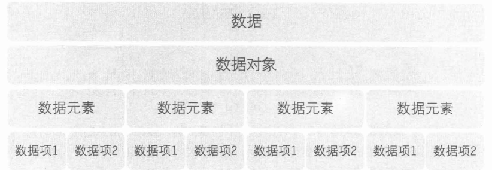
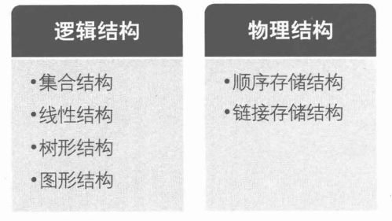
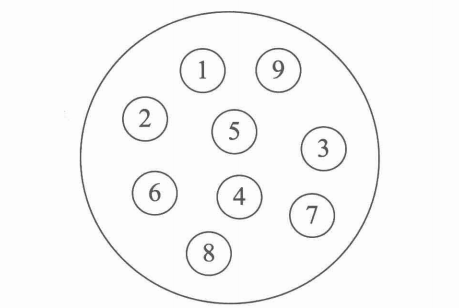
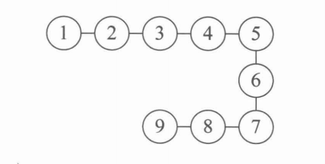
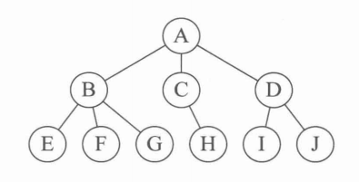
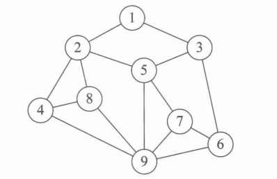
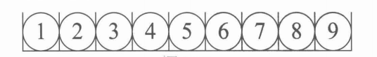
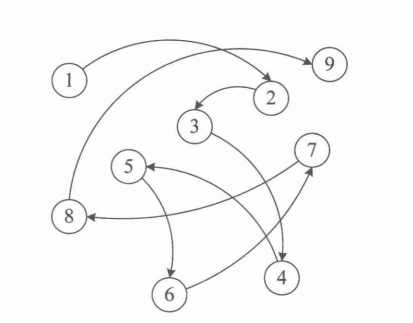
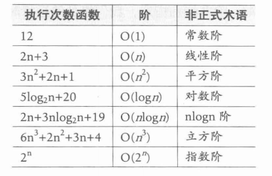
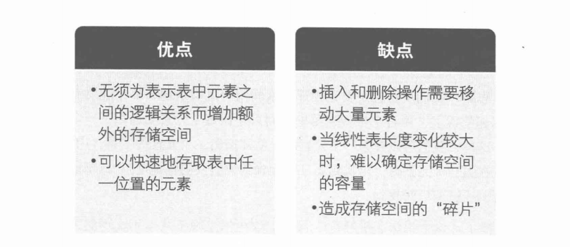

#数据结构
###数据结构是一门研究非数值计算的程序设计问题中的操作对象，以及它们之间的关系和操作等相关问题的学科
##一、数据结构绪论
###基本概念和术语

####1.数据：是描述客观事物的符号，是计算机中可以操作的对象，是能被计算机识别，并输入给计算机处理的符号集合。

```angular2html
数据必须具备两个前提：
1.可以输入到计算机中
2.能被计算机程序处理
```
####2.数据元素：是组成数据的、有一定意义的基本单位，在计算机中通常作为整体处理。也被称为记录。
####3.数据项：一个数据元素可以由若干个数据项组成。
```angular2html
数据项是数据不可分割的最小单位
```
####4.数据对象：是性质相同的数据元素的集合，是数据的子集。
####5.数据结构：是相互之间存在一种或多种特定关系的数据元素的组合。
###逻辑结构和物理结构

###逻辑结构：是指数据对象中数据元素之间的相互关系（针对具体问题）
####1.集合结构：集合结构中的数据元素除了同属于一个集合外，它们之间没有其他关系

####2.线性结构：线性结构中的数据元素之间是一对一的关系

####3.树形结构：树形结构中的数据元素之间存在一种一对多的层次关系

####4.图形结构：图形结构的数据元素是多对多的关系

```angular2html
我们在用示意图表示数据的逻辑关系时，要注意：
1.将每一个数据元素看做一个结点，用圆圈表示
2.元素之间的逻辑关系用结点之间的连线表示，如果这个关系是有方向的，那么用带箭头的连线表示
```
###物理结构：是指数据的逻辑结构在计算机中的储存形式
####1.顺序存储结构：是把数据元素放在地址连续的存储单元里，其数据间的逻辑关系和物理关系时一致的

####2.链式存储结构：是把数据元素存放在任意的存储单元里，这组存储单元可以是连续的，也可以是不连续的。

###抽象数据类型
####1.数据类型：是指一组性质相同的值的集合及定义在此集合上的一些操作的总称
```angular2html
在C语言中，数据类型可以分为两类：
1.原子类型：是不可以再分解的基本类型，包括整型、实型、字符型等。
2.结构类型：由若干个类型组合而成，是可以再分解的。
```
####2.抽象：是指抽取出事物具有的普遍性的本质
####3.抽象数据类型：是指一个数学模型及定义再该模型上的一组操作
##二、算法
###算法基础
####1.定义：算法是解决特定问题求解步骤的描述，在计算机中表现为指令的有限序列，并且每条指令表示一个或多个操作
####2.基本特征：输入、输出、有穷性、确定性和可行性
###算法设计的要求
####1.正确性：算法的正确性是指算法至少应该具有输入、输出和加工处理无歧义性，能正确反映问题的需求、能够得到问题的正确答案
```aidl
四个层次：
1.算法程序没有语法错误
2.算法程序对于合法的输入数据能够产生满足要求的输出结果
3.算法程序对于非法的输入数据能够得出满足规格说明的结果
4.算法程序对于精心选择的，甚至刁难的测试数据都有满足要求的输出结果
```
####2.可读性：算法设计的另一目的是为了便于阅读、理解和交流
####3.健壮性：当输入数据不合法时，算法也能做出相关处理，而不是产生异常或莫名奇妙的结果
####4.时间效率高和存储量低
###算法效率的度量方法
####1.事后统计方法：这种方法主要通过设计好的测试程序和数据，利用计算机计时器对不同算法编制的程序的运行时间进行比较，从而确定算法效率的高低
####2.事前分析估算方法：在计算机程序编制前，依据统计方法对算法进行估算
```aidl
消耗时间取决因素：
1.算法采用的策略、方法
2.编译产生的代码质量
3.问题的输入规模
4.机器执行指令的速度
```
###函数的渐近增长
####函数的渐近增长：给定两个函数f(n)和g(n)，如果存在一个整数N，使得对于所有的n>N,f(n)总是比g(n)大，那么，我们说f(n)的增长渐近快于g(n)
###算法时间复杂度
####1.定义：在进行算法分析时，语句总的执行次数T(n)时关于问题规模n的函数，进而分析T(n)随n的变化情况并确定T(n)的数量级。算法的使劲按复杂度，也就是算法的时间量度，记作：T(n)=O(f(n))。它表示随问题规模n的增大，算法执行时间的增长率和f(n)的增长率相同，称作算法的渐近时间复杂度，简称为时间复杂度。其中f(n)是问题规模n的某个函数。
####2.推导大O阶方法
```aidl
推导大O阶：
1.用常数1取代运行时间中的所有加法常数。
2.在修改后的运行次数函数中，只保留最高阶项。
3.如果最高阶项存在且不是1，则去除与这个项相乘的常数。
得到的结果就是大O阶。
```
###常见的时间复杂度

####O(1)<O(log~n)<O(n)<O(nlog~n)<O(n^2)<O(n^3)<O(2^n)<O(n!)<O(n^n)
###最坏情况与平均情况
####运行时间一般都是最坏情况的运行时间
####平均运行时间是期望的运行时间
####一般在没有特殊说明的情况下，都是指最坏时间复杂度
###算法空间复杂度
####算法的空间复杂度通过计算算法所需的存储空间实现，算法空间复杂度的计算公式记作：S(n)=O(f(n))，其中，n为问题的规模，f(n)为语句关于n所占存储空间的函数。

##三、线性表
###定义：零个或多个数据元素的有限序列
###线性表的顺序存储定义
####1.顺序存储结构：指的是用一段地址连续的存储单元依次存储线性表的数据元素
```aidl
顺序存储结构的三个属性：
1.存储空间的起始位置
2.线性表的最大存储容量
3.线性表的当前长度
```
####插入算法的思路
```aidl
1.如果插入位置不合理，抛出异常
2.如果线性表长度大于等于数组长度，则抛出异常或动态增加容量
3.从最后一个元素开始向前遍历到第i个位置，分别将它们都向后移动一个位置
4.将要插入元素填入位置i处
5.表长+1
```
####删除算法的思路
```aidl
1.如果删除位置不合理 ，抛出异常
2.取出删除元素
3.从删除位置开始遍历到最后一个元素位置，分别将它们都向前移动一个位置
4.表长+1
```
####线性表顺序存储结构的优缺点

